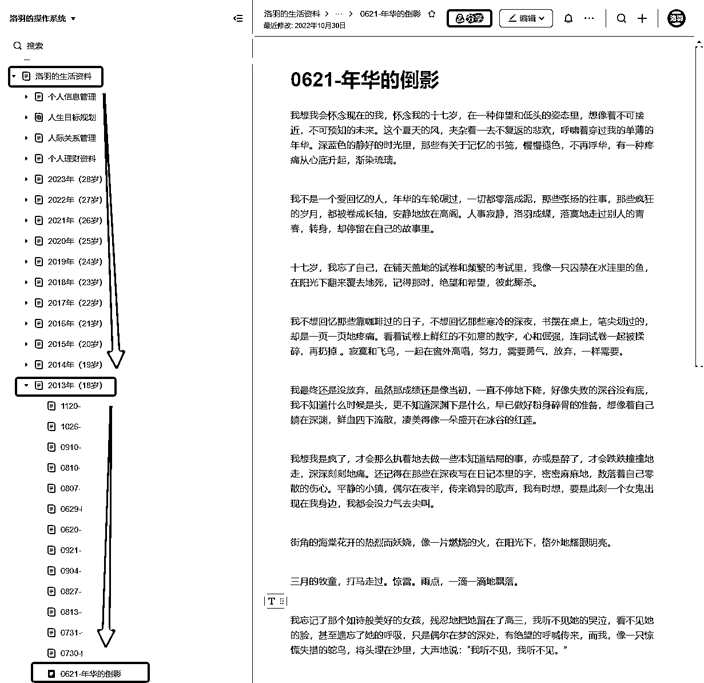

# 5.1 通过分类快速查找 @洛羽

只要大家能够弄懂前面我对于资料的整体性分类逻辑，并且能够在实践过程中，把这个逻辑灵活运用，甚至优化成自己喜欢的模式。

那么分类查找，对于大家来说就一定很简单。

因为我们的大脑已经对自己的资料库分类结构很熟悉了，它们就像是内脑和外脑一样，是共通的。我们对于每一份资料存放的地方，可以说是了然于心。

比如：我想要查找一篇 10 年前写的随笔《年华的倒影》，直接打开“洛羽的操作资料库”>>“洛羽的生活资料”>>"2013 年"目录，再根据时间顺序，很快就能定位到具体内容了：

