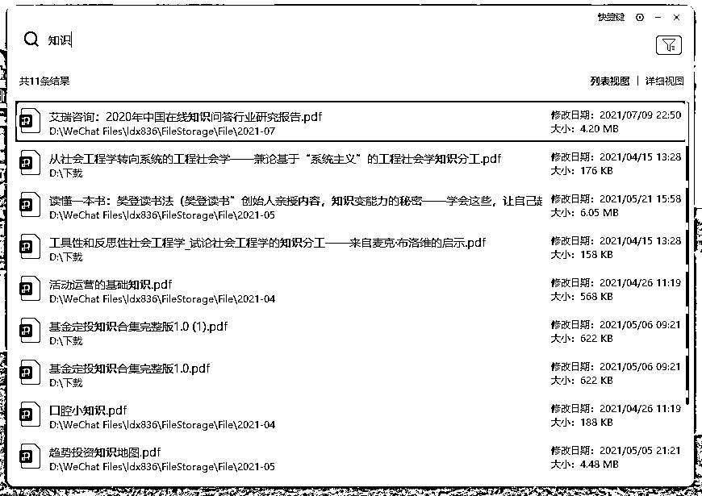
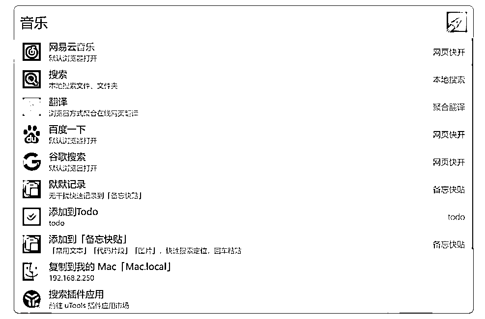
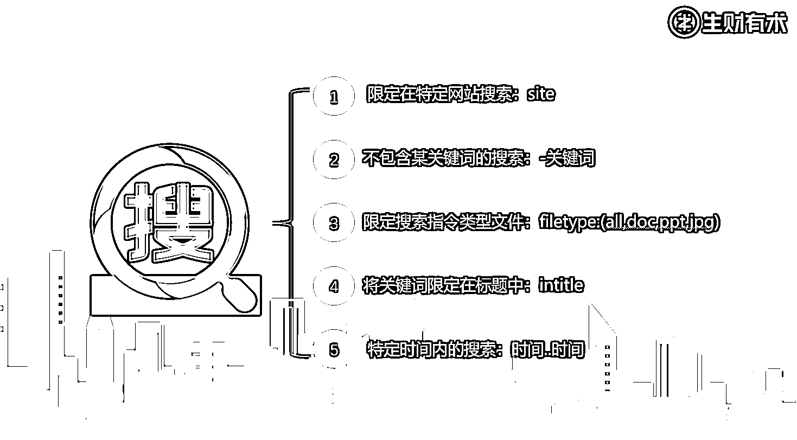
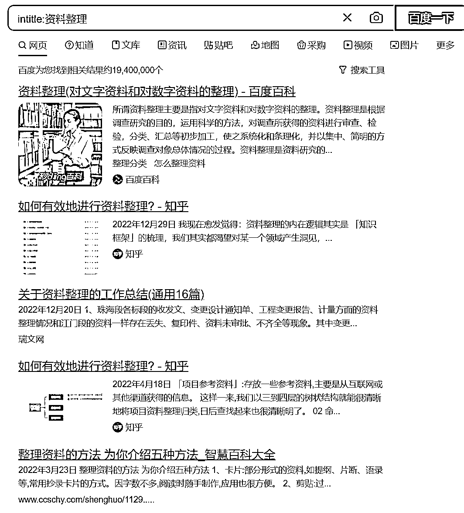

# 5.3 通过搜索工具查找 @七小 @Jerry

1、有哪些常见的搜索工具？@七小

这里专门讲搜索工具，讲的是用来搜索电脑本地资料的工具。

本地的资料归档完成，命名完成，但是用电脑磁盘的搜索很慢，不符合我们说的「快速调用」

所以，要用更好的搜索工具去达到「快速调用」的目的

win 用户： everything、腾讯桌面整理、元气桌面 （三个的搜索可以快速查找）

Mac：Alfred （我没用过，听说是可以的，请自行测试）

我用元气桌面的使用效果，输入关键词，不管把文件放在哪，都能很快检索到。

还有一些聚合搜索工具：火萤酱，及 uTools，这俩是 everything 上套了壳，功能更多更方便一些。

内容来源：[3 月 8 日《资料管理的整理规则与工具》@七小](https://shengcaiyoushu01.feishu.cn/docx/ETXtdOLyuo5I0LxrpbWcXCminAd)

2、有哪些好用的搜索指令？@Jerry

搜索指令有很多，不用全部记下来，下面分享几条最常用搜索指令，可以大大提升搜索效率。

•site:表现形式是： site:+网址。应用于指定网站的站内搜索，直接站内搜索不能得到理想结果时，试试这个，baidu 和 Google 均支持该指令。

例：想在政府网站搜用：site:gov.cn；想在知乎搜就用：site:zhihu.com

•-关键词：减号的用法是做搜索结果的排除，这个指令可以跟大多数指令进行配合，使搜索结果更加精准。 使用这个指令时减号前面必需是空格，减号后面没有空格，紧跟着需求排除的词，baidu 和 Google 均支持该指令•还有一个小方法，可以试试“资料整理 -广告”，发现百度前几排的广告不见了

•filetype:：搜索限定某种指定类型的文件，非常适合用来搜索专业文档资料，baidu 和 Google 均支持该指令

例：filetype:pdf（可替换为任意文件格式后缀，如 doc，jpg），搜索来就都是文件。

•intitle: 表示限定搜索标题的内容，即标题必须包括限定的关键词，这样搜出来的东西更切合主题。

例： intitle:资料整理，baidu 和 Google 均支持该指令。

•时间 1..时间 2：表示限定搜索结果的时间范围关键词+空格 +20xx+..+20xx

如，我们想搜索 2022 年的研究报告，那就可以用：报告 2022..2022

注意：

在搜索信息的时候，为求精准快速，要尽可能避免口语化的描述。

内容来源：[3 月 13 日《信息超载时代，如何高效搜索并解决问题？》@Jerry](https://shengcaiyoushu01.feishu.cn/docx/OySOdxU2Ko40kNxauTCcOQoWntc)

