# 案例一：用知识体系搭建个人生财认知 @闻小聪

1、背景介绍

大家好，我是闻小聪，本职是一名互联网产品经理，职业要求让自己成为了一名重度知识付费者。在累计花费了 5 位数后，意识到成人学习并不在量多，关键是要形成个人知识框架。2020 年加入了生财有术，看了很多大佬分享的精华帖后，也开始反思并实践如何将这些生财知识内化到自己的知识管理体系中。

1）我为什么开始知识管理

正式开始讲方法前，想和大家介绍下我为什么要进行知识管理，以及知识管理给我带来的益处。任何的方法、工具都存在适用边界，了解出发点，是一个很好的鉴别这个方法或工具是否适合自己的好办法。

下面这几条是我还没有开始知识管理时经常遇到的问题：

•每天至少 2 个小时以上，在各类微信公众号、知乎等渠道上获取信息，一天不看，就会觉得自己落伍，生怕错过最新信息，自己逐渐地变得“知识焦虑”

•每天看起来都有大量输入，但到晚上反思自己今天的收获时，却没有一点思路，并没有内化为自己的东西

•看过=忘记，收藏了大量精品文章，但到真正需要使用时，依旧找不到，没有发挥它们真正的价值

后来，一次偶然的机会，接触到了“知识管理”、“卡片式创作”的理论，发现原先自己对于知识的误区就在于“囤积”，而忽视了“消化”。明白这个道理后，我开始踏上了知识管理之路。

2）知识管理后取得的成果

经过一年的时间，目前积累了 900+精华文章，横跨 10 多个领域，主要使用“印象笔记”作为第二大脑图书馆，利用笔记本+标签的形式搭建起了整个知识框架。好处就在于看到某篇看起来很新奇的内容时，会马上意识到这块属于自己知识体系中的哪一块，与哪些知识是有关联性的，这样就不会陷入“信息恐慌”中。

比如：这张图是我的印象笔记标签截图，可以清楚的看到我的专业知识涉猎领域主要在需求调研、产品设计、交互设计，学科上以关注经济、管理、心理学为主，个人兴趣涉及手账、音影、家居、旅行。

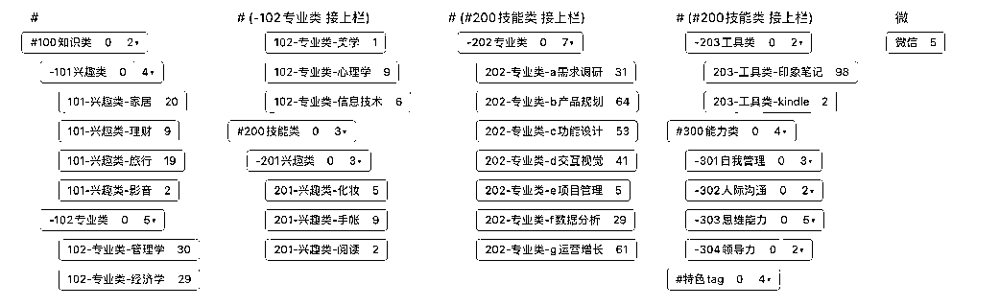

根据我的笔记内容，印象笔记自动生成的知识图谱中，大部分领域则在科技、传媒、社会、房产这块。

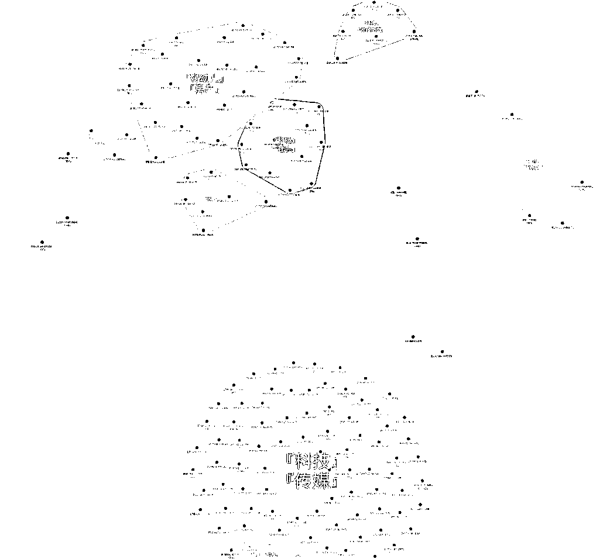

借助知识体系，让我了解了自己主要关注的信息方向。也正因为如此，我意识到了自己在理财、金融方面的信息渠道和关注点是不够的，如此就能知道自己下一步要如何行动了。是不是很神奇～

2、知识管理的误区

俗话说，不破不立。切入正题前，需要先正确的认识知识管理这个事情。

在知乎上很常见的一个问题「如何记笔记？」. 在这个问题下面有超级多人回答了各种方法，还有搭配各类精美的笔记截图。却没有人问为什么要记笔记。之前就在明白老师的知识星球里也看到有圈友问如何记学习笔记，明白老师的回答只问了 2 个问题「为啥要记笔记？」「为啥要获取主要信息？」

很多时候，九年义务教育让我们对于学习的理解就停留在了「记录」上，而忽视了「记录」的作用。记录是为了更好的忘却。在有用时，能快速找到，这个才是真正的目的。

很多人会认为知识管理就是文档管理，将收集到的资料通过文件夹的方式，分门别类的分类整理。但这个恰恰是最大的误区。对知识管理来说，知识整理是最初级的，最终目的是为了在有需要时，能帮助我们实现快速的「知识调用」，这个才是管理的最大价值。

3、如何搭建个人知识体系

我们将接收到的信息按照一定方式组织起来，这个「方式」就是知识体系。每个人的知识体系都不一样，这与个人的兴趣、偏好都有关系。要形成自己的知识体系，对知识进行处理非常关键。在不断的处理中，会逐渐形成个人知识体系。

知识的处理流程主要包括 4 个部分：

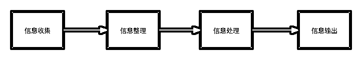

•信息处理：利用笔记本体系处理信息流

•信息整理：利用标签+标题，对核心信息进行提炼与分类，便于在需要时进行快捷的信息调用

•信息加工：这里的加工是指对于输入的内容经过自己的思考后，沉淀卡片式的思考记录

•信息输出：将相同内容的卡片思考，组合成完成的文章后输出，与他人分享

1）信息处理

这步是每日都要进行的，就是将每天自己看到的，认为有价值的（可能是当下，也可能是以后）信息收集起来。此处比较推荐汇总到一个地方，比如我就是使用印象笔记来收集所有信息的，这样当要搜索某个信息或某篇文章时，就在印象笔记中查找就可以了，不需要多个地方去检索；另一个好处就是集中管理，减少多个地方要定期整理的麻烦。

我借鉴了 GTD 的理论，采用“收集-处理-归档”的方式对信息进行处理。对应到印象笔记中，我用文件夹来实现这个流程。

可以看到，2019 年之前，我的笔记本有 9 个大类，根据文章内容进行分类，而且是树状方式。2019 年后，则是根据“收集-处理-归档”处理流程，更改为 4 个大文件夹，分别是：

•收集箱：用于存放所有收集到的认为不错的，但还未整理过信息

•沉淀：这里存放的都是对输入的信息进行过个人加工的笔记，也就是“加工品”

•项目与归档：这 2 个文件夹都是对应“归档”流程，因为项目是还在进行中的，所以单独拎了一个文件夹进行区分，方便查找；归档中的笔记都是已经经过处理加工的。

主文件数减少到 4 个以内，对笔记进行整理时会更加快捷，不需要再去纠结到底放在哪个分类中，而对笔记分类的重任就交给了标签体系。这样做的理由会在 2.3 中给大家详述。

按照这个流程，我的日常信息处理过程就是：

每天的通勤途中或上班时，当看到自己感兴趣或觉得不错的往后可能会用到的优质信息时，会将其生成笔记放入“收集箱”中；每个周末抽 1～2 个小时，对收集箱中的信息再次回顾，此时会对信息添加标签、修改标题，也会进行重点内容的标注，有的会摘录到“沉淀”文件夹并写下当时的感受；处理完成后，就将这篇笔记放入“项目”或者“归档”文件夹中，表示已处理完成。

这样的处理过程，没有任何压力，可根据自己的时间进行安排。

2）信息整理

整理的最终目的是为了方便检索。采用标签而不是文件夹作为笔记的内容分类，是因为标签网状的方式更容易操作。一篇文章中往往会包含多个内容，如果只是文件夹的树状方式，会很纠结到底要放在哪个文件夹下面，而标签就完全没有这个烦恼了。

标签体系，2019 年版本我是采用了“工作”、“生活”、“学习”来进行细分的。在实际使用时，发现工作和学习很难区分，大多数我学习内容都是为工作服务的。所以在 2020 年，接触“冰山理论”后，我将标签体系重新按照“知识”、“技能”、“能力”来进行分类。这样分类后，可以很清晰的了解到自己目前的能力分层。

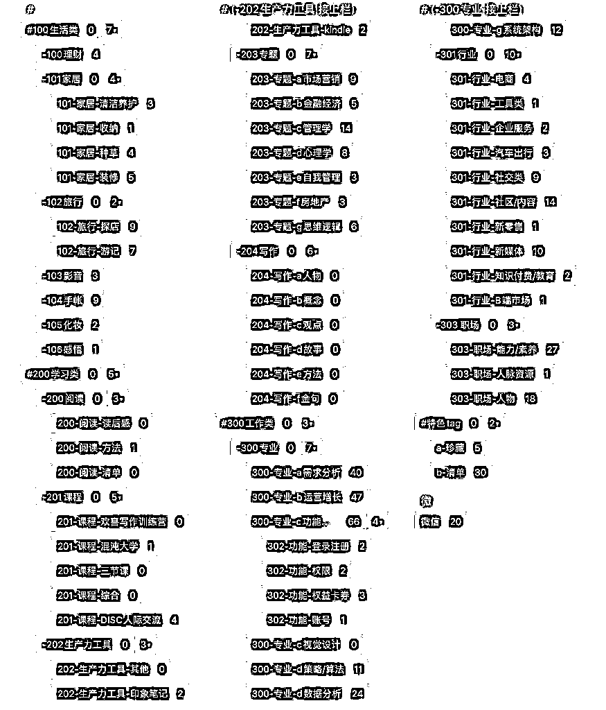

2019 年版本的标签体系

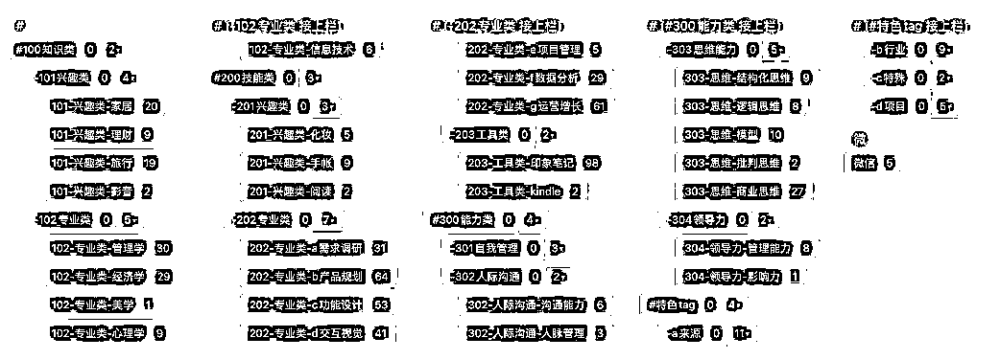

2021 年版本的标签体系

更重要的是，在涉足新的领域时，通过标签就可以很轻松地搭建出能力框架。以产品经理为例，一个合格的产品经理，在技能方面，会需要掌握需求分析、产品设计、功能设计，交互视觉、项目管理、数据分析、运营等；在知识层面，会涉及到管理学、经济学、金融学、心理学、信息技术等；能力层级就是结构化思维、逻辑思维、批判思维等。

也可以借助框架，在进入新领域时先让自己有一个整体认知。再多的信息接收时，也能轻松的知道是属于哪个部分的。

特别要说明的是，我另外又新建了一个特色 tag，用来归纳区别于上述 3 种类型的标签。

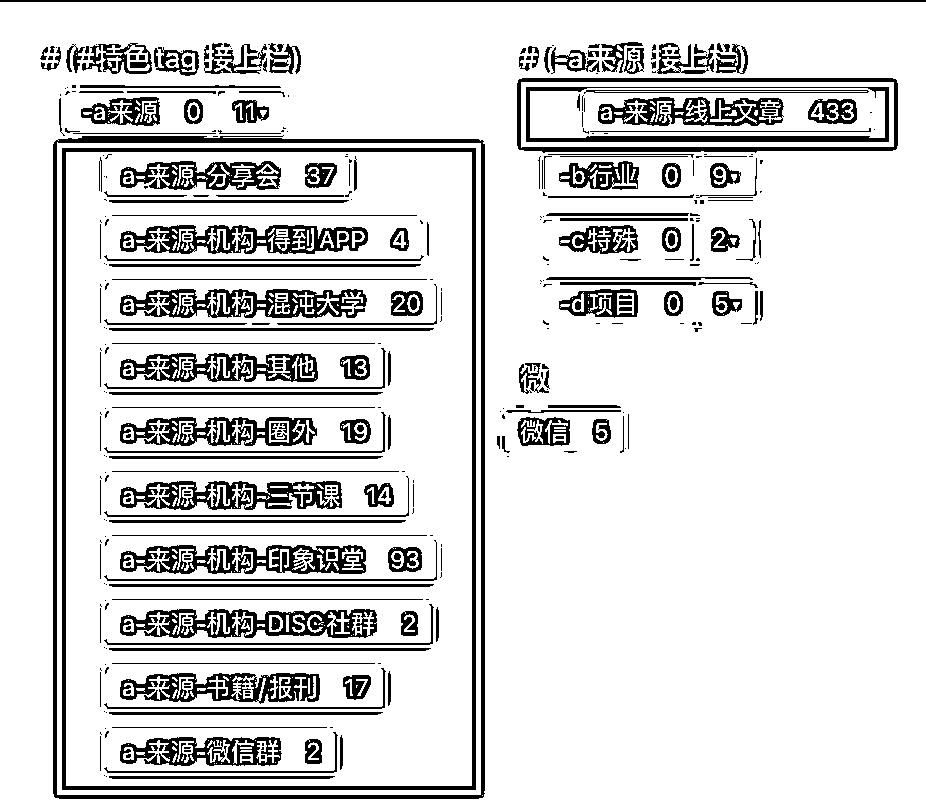

•来源标签。这个标签主要是给各类信息标注我是从哪里获取到这个信息的。这样我就可以很清楚的看到我的信息获取渠道有哪些，哪些渠道对我来说是值得重点投入时间的高质量信息渠道。

•行业。行业属性也是一个很有辨识性的分类。比如，同样是讲小红书的运营，美妆类的内容和家居生活类的内容在需要掌握的知识、技能和能力上相同，在具体细节实施上会有细微区别。这个就是行业的属性。

•特殊。这个分类我主要是标注了清单类型和珍藏类型的笔记。清单用于检索，珍藏是提醒自己要多回顾的。

•项目。如果项目还在进行中，我会用文件夹维度来区分，因为是要经常用到的，用文件夹会更跨界；如果项目已经结束了，我就会改为打上项目的标签，再把与项目有关的笔记都挪动到“归纳”文件夹下面，这样保证文件夹的级数不至于过多。

上面就是整个标签搭建的逻辑。仅以个人的方式作为实例，每个人的情况都会不同，按照自己最舒服的方式来搭建标签就可以了。关于这块的搭建思路，提供给大家一个方法：整备一张 A4 纸，脑暴你所需要的各类笔记内容和范围，然后再按一定逻辑进行梳理就可以了。刚开始也不用太要求标签体系要如何完美，先搭建起来，在以后的实践中可以不断得去调整优化。

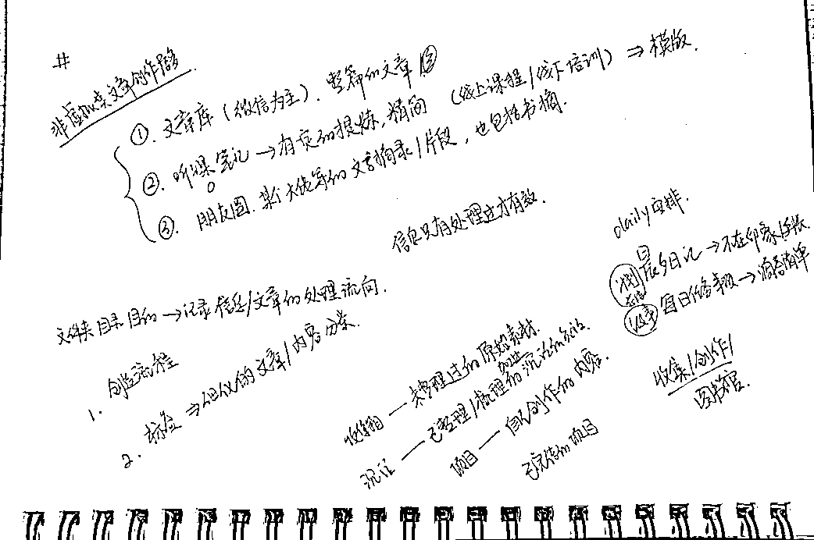

我在整理标签和文件体系时的手绘草稿

3）信息加工

有了原材料后，就要进行切菜准备了。信息加工就是从收集到的内容中摘录出对自己有启发、有帮助的部分，并增加自己的思考，形成卡片。

卡片的概念，来自于德国社会学家尼克拉斯·卢曼。据说他一生积累了 9,0000 多个知识卡片。他曾说过他的很多研究灵感，重要的论文和著作，都是来源于这些平时收集的卡片。

卡片的使用方法非常简单：每张卡片仅记录 1 个知识点，同时记录关于这个知识点的个人感想。相比较常规的一篇笔记记录整本书的摘录来说，拆分成最小知识单元的知识卡片，更容易进行检索。进行写作创造时，也可以更轻松的找到需要的卡片进行拼凑即可。

最早我是使用印象笔记来进行知识卡片创作的。但后面发现，每次要写一个知识卡片，打开印象笔记进行创作的步骤很复杂。直到遇到了 flomo，极简的操作非常时候记录下临时的碎片化思考。flomo 也支持标签分类，很方便的就能给卡片归类整理。

所以，信息加工的流程操作上，我一般是电脑屏幕左边打开印象笔记，右边打开 flomo，当看到有令自己心动的内容时，直接复制粘贴到 flomo 中，并打上#摘录 的标签，同时添加印象笔记中这篇笔记的链接地址，方便以后追根溯源。

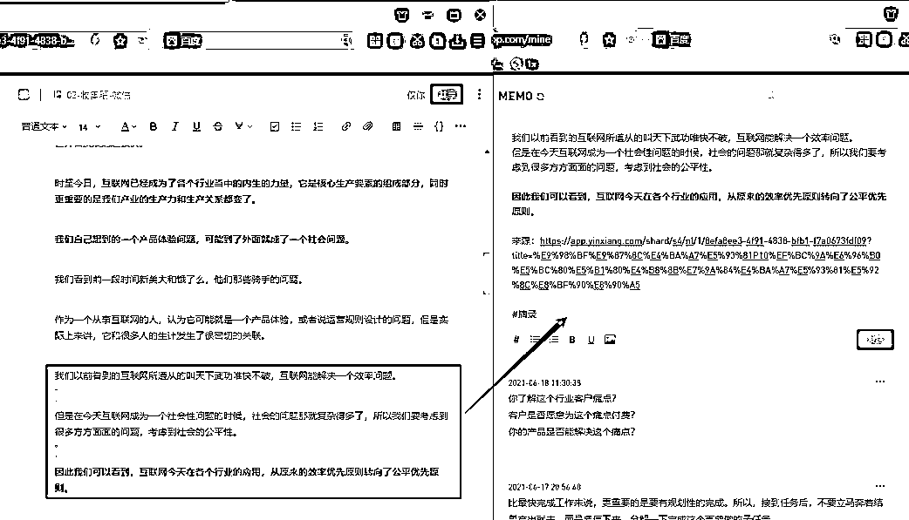

若对这段摘录的内容有个人想法，会使用 flomo 的“批注”功能，写下自己的随想，再为这篇批注打上标签分类。这样，flomo 会自动关联这 2 个卡片。

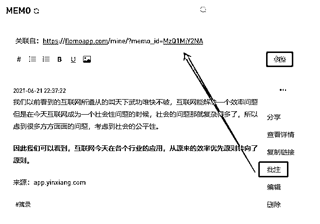

当然，你如果愿意，也可以在印象笔记中添加 flomo 的链接，这样点击后就可以直接看到 flomo 中的笔记了。

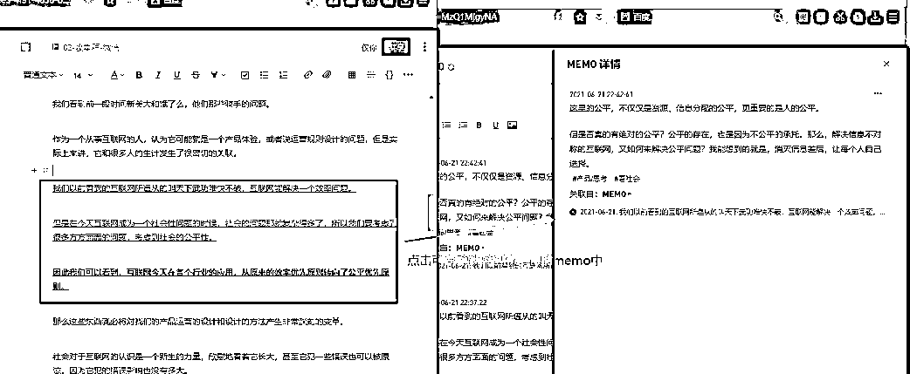

4）信息输出

当积累了一定数量的卡片后，就可以针对 1 个主题进行集中输出了。这一步才是知识生产制造中最关键的一步。以前，确定一个主题后，就要开始各种搜索资料，收集内容，而现在，只需要在印象笔记+flomo 中搜索与主题相关的内容，即可快速生产内容了。

比如，生产这篇文章时，我就是利用碎片时间先在 flomo 中写了文章的大纲框架。然后，在印象笔记中搜索有关的笔记内容，再进行文章串联。最后，对整篇文章进行润色加工，不到 3 小时，就完成了 3000 多字的内容初稿。

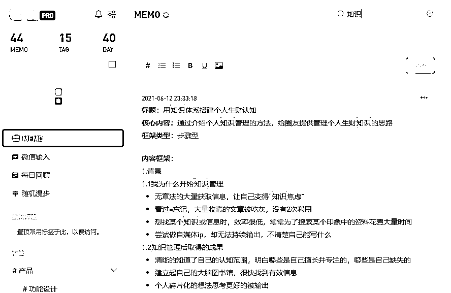

利用 flomo 整理文章框架

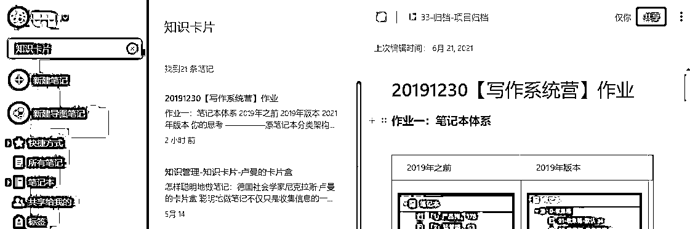

在印象笔记中搜索相关引用内容

4、实操：外卖 CPS 项目

前面讲的比较理论一点，似乎是更适合作家来进行的知识管理。就作为一个普通的圈友，如何用这套体系来更好的使用生财有术星球内的知识呢？

比如，我作为一个新手想尝试外卖 CPS 的项目。生财有术上有很多此类文章，但看多了就眼花缭乱，没有头绪。采用前面提到的信息加工方式，是可以在短时间内让我们对这个项目所要具备的东西有个框架认知，甚至能输出 SOP 开始执行。下面就简单实操一下。

1）搭建框架

就像沐文老师说的，写内容前一定要先搭框架。同样，从一个陌生领域切入时，也一定要先搭建起个人知识框架。

这里提供一个我个人用的屡试不爽的方法：找目录。比如，我们看一本书之前，通过目录就能简单了解整本书要讲的内容以及作者的大致思路。所以，反推到“外卖 CPS”项目，我们也可以找这类有关键性目录的文章。这个时候就不得不夸一下生财有数的运营团队，项目库真的是一个好东西。我就直接在项目库中找到了一篇《外卖 cps 资料整理汇总，方便大家系统性、针对性的学习，不在小航海也能扬帆起航！》汇总文，非常清晰的梳理了整个框架，包括：市场前景、前期准备、工具准备、推广运营。

当然，你也可以多参考几篇文章，结合起来丰富自己的框架。

通过这篇汇总文，反推到我自己的知识体系中，我清楚发现运作这个项目要具备的知识包括运营、推广、营销、自媒体，在我原来搭建的标签体系中已有涉及。所以，我只需要在“来源”的标签下增加生财有术的来源，在“行业”标签中增加广告媒体就可以了。其他的标签都不需要添加。这恰恰也说明，选择这个项目作为副业的正确性，基本都能使用我原来已有的技能即可。

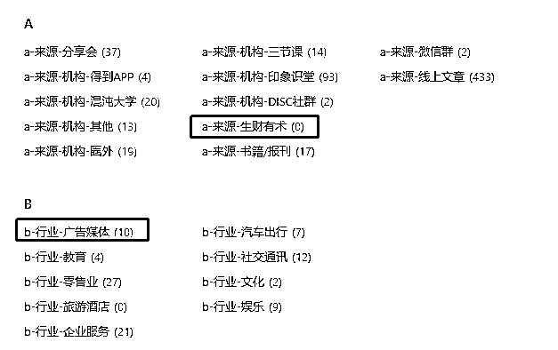

另外，由于这个项目处于进行中状态，为了方便自己查阅，我就在文件夹的“项目”下新建了一个叫“外卖 cps”的文件夹。这样，框架体系就初步搭建完成。

2）阅读文章

接下来就是广泛阅读生财有术中与外卖 CPS 相关的所有文章。主要目的就是搜集所有有用信息，以便于后期的加工处理。

时间安排上，我一般会采用碎片时间来阅读，看到不错的文章通读一遍后就收藏进印象笔记，待下一步的整理加工。为了最大化的时间利用率，推荐先阅读精华文章，再去阅读热门文章，最后是其他的。混在生财有术中，最好的一点就是已经有大佬帮我们把精华信息都提取出来了，没错，就是要重点看精华文！！！！

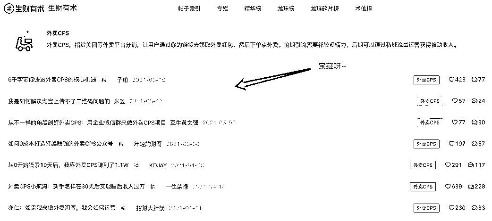

觉得不够多？那就衍生阅读有涉及相关技能类的文章，比如地推、营销、公众号转化，都可以在生财有术中直接搜索查找。

3）信息整理

信息收集这边，不需要太多。大部分文章看到后面其实会发现都是类似的。一般是看完 20 篇精华文后，就可以开始着手对文章的整理和加工了。

这一步，建议是找个悠闲的午后，需要静下心来将收藏的文章进行二次精读。这次阅读，会需要一边看一边将你觉得重要的信息记录下来。可以直接在文章中标记，也可以用 flomo 摘录。摘录后，一定要加上自己的感想。如果有觉得相关性比较高的文章，可以用超链接关联起来。最重要的是记录下自己的感想，以及对自己重要的信息。

也可以汇总多篇文章，整理出自己的 SOP 流程。在各个小流程节点，附上自己认为这个步骤写得最好的文章链接。这样能清晰知道接下来自己要如何开始执行，以及每一步执行中需要注意的点。有需要时，也能方便的检索到。

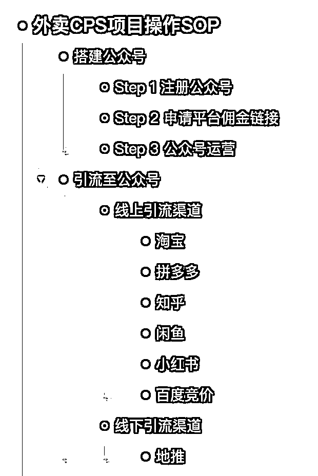

总的来说，收集和加工是不断重复的。整理完一次，再吸收新知识，再用新知识完善原来的信息。而且，我们星球上的文章逻辑都是很清晰的，整理起来是非常简单的。

4）信息输出

经历过 N 轮收集+处理后，终于对外卖 CPS 的整体操作方法有大概认知了。现在就可以根据 SOP，再拆解具体完成的时间点，规划里程碑，然后每日执行和定期复盘了。

当然，也可以将整理好的内容重新梳理，加上自己的感想，分分种就可以输出一篇龙珠文。

相比较传统的看一篇文章，这种方式下来，是可以在短时间内就建立一个全局认知的，真正操作时更能做到心中有数，能清楚知道自己在哪个大框架中的哪一步。

以上仅是我个人的知识管理体系方法，也依然在不断结合自己的工作、生活状态进行调整。如果这篇文章对各位圈友有所帮助，就是我的小荣幸了。也欢迎各位一起交流心得。我始终相信，这是一个对于终身学习者最好的时代。

内容来源：《如何用知识体系搭建个人生财认知》

