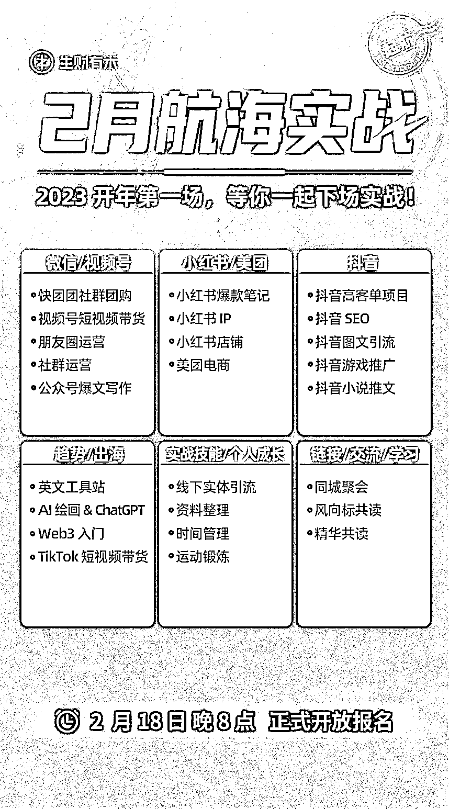
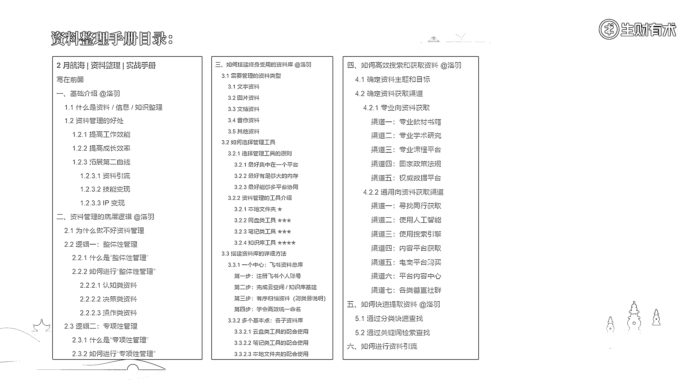

# 案例四：用星球帖制作航海实战手册 @洛羽

生财有术 2 月航海，一共有 25 个选题，其中需要制作手册的有 21 个。面对下面 20 多个选题，如果是大家来做手册，你们会怎么思考和操作？

以我主创的资料整理选题为例，它算不算是一个专项性内容？

要把一个专项性内容讲清楚讲明白，让看的同学觉得逻辑清晰，能明白背后的逻辑，也能亲自上手实操，其实还挺不容易的对吧。

这个时候，我们就可以采用“道-法-术-器-用”的模型啦！

“道”主要包括了概念、定义、理念和目的。它主要承担的作用是讲清楚该细分领域到底“是什么”，我们研究它到底是“为了什么”，该领域存在的意义和价值在哪里。

那我们是不是应该讲讲资料整理是什么、为什么要做资料整理、它的好处和价值在哪里呢？

“法”是在探求“道”的过程中，经过实践思考、总结归纳出的规则体系和方法原则（比具体方法更抽象化），属于高度提炼总结的规律。

那我们是不是应该讲讲资料整理的底层逻辑是什么，有什么需要注意的核心原则和定律呢？

“术”是具体的操作方法，指的是我们为了研究这个领域，采用了什么步骤、途径、手段、技术。

那我们是不是应该讲讲资料整理的具体方法和步骤是什么，怎么找内容，怎么搭建资料库，怎么查找和使用呢？

“器”是在验证“法”和追求“道”的过程中，为了能够让“术”得到落地实施，所采用的一系列工具。

那我们是不是应该讲讲，资料整理可能用到的工具有哪些，怎么使用等？

“用”是一些实际的使用场景，还有可以参考的各种案例。

那我们是不是应该讲讲，针对一个细分领域的资料整理，大家已经跑通了的案例有哪些，具体是怎么思考怎么做的？

有了这个思路，大家再来看资料整理的目录逻辑，是不是符合这个模型呢？

第一部分是“道”，第二部分是“法”，第三、四、五部分是“术”“器”“用”的结合。

以上就是资料的整体性和专项性分类管理方法，不知道大家是否有理解？

内容来源：《做好资料管理，实现人生三倍速增长》

